# Оглавление
1. [Подходы к разработке программных средств. Их краткая характеристика.](#подходы-к-разработке-программных-средств-их-краткая-характеристика)
  1. [Метод функциональной декомпозиции.](#метод-функциональной-декомпозиции)
  2. [Анализ потоков данных](#анализ-потоков-данных)
  3. [Объектно-ориентированный подход](#объектно-ориентированный-подход)
  4. [Agile-методики](#agile-методики)
2. [Жизненный цикл программного продукта. Основные понятия.](#жизненный-цикл-программного-продукта-основные-понятия)
  1. [Процессы жизненного цикла](#процессы-жизненного-цикла)
3. [Модели жизненных циклов программного обеспечения, их характеристики и области применения.](#модели-жизненных-циклов-программного-обеспечения-их-характеристики-и-области-применения)
4. [Особенности модели жизненного цикла «спираль»](#особенности-модели-жизненного-цикла-спираль)
5. [Методы «быстрой разработки» их суть и условия применения.](#методы-быстрой-разработки-их-суть-и-условия-применения)
6. [Планирование разработки программного обеспечения. LOC и FP-метрики. СОСОМО модель.](#планирование-разработки-программного-обеспечения-loc-и-fp-метрики-сосомо-модель)
  1. [LOC и FP-метрики.](#loc-и-fp-метрики)
7. [Виды контроля программ; статические и динамические методы контроля. Тестирование и отладка.](#виды-контроля-программ-статические-и-динамические-методы-контроля-тестирование--и-отладка)
  1. [Виды контроля программ](#виды-контроля-программ)
  2. [Тестирование и отладка.](#тестирование--и-отладка)
8. [Методы функционального тестирования.](#методы-функционального-тестирования)
  1. [Метод эквивалентного разбиения.](#метод-эквивалентного-разбиения)
  2. [Метод граничных значений.](#метод-граничных-значений)
9. [Методы структурного тестирования. Граф управления программы. Тестирование путей, цикломатическая сложность программы.](#методы-структурного-тестирования-граф-управления-программы-тестирование-путей-цикломатическая-сложность-программы)
10. [Совместное использование функционального и структурного тестирования.](#совместное-использование-функционального-и-структурного-тестирования)
11. [Тестирование программных комплексов, построенных методом функциональной декомпозиции](#тестирование-программных-комплексов-построенных-методом-функциональной-декомпозиции)
12. [Тестирование программ и жизненный цикл программного продукта.](#тестирование-программ-и-жизненный-цикл-программного-продукта)
13. [Общая характеристика и назначение языка UML.](#общая-характеристика-и-назначение-языка-uml)
14. [Диаграммы вариантов использования, назначение, компоненты, отношения между компонентами.](#диаграммы-вариантов-использования-назначение-компоненты-отношения-между-компонентами)
15. [Диаграмма последовательности и кооперативная диаграмма, их назначение, компоненты.](#диаграмма-последовательности-и-кооперативная-диаграмма-их-назначение-компоненты)
  1. [Диаграмма последовательности](#диаграмма-последовательности)
  2. [Диаграмма кооперации](#диаграмма-кооперации)
16. [Диаграмма классов, характеристики класса](#диаграмма-классов-характеристики-класса)
17. [Диаграмма классов, типы и характеристики отношений между классами.](#диаграмма-классов-типы-и-характеристики-отношений-между-классами)
18. [Диаграмма состояний: назначение, компоненты.](#диаграмма-состояний-назначение-компоненты)
19. [Диаграмма деятельности: назначение, компоненты.](#диаграмма-деятельности-назначение-компоненты)
20. [Диаграммы компонентов и размещения, их назначение, компоненты.](#диаграммы-компонентов-и-размещения-их-назначение-компоненты)
  1. [Диаграммы компонентов](#диаграммы-компонентов)
  2. [Диаграммы размещения](#диаграммы-размещения)
21. [Унифицированный процесс разработки программных средств. Общая характеристика и этапы. Основополагающие принципы разработки программных средств по унифицированному процессу.](#унифицированный-процесс-разработки-программных-средств-общая-характеристика-и-этапы-основополагающие-принципы-разработки--программных-средств-по-унифицированному-процессу)
22. [Процесс определения требований к программным средствам. Документирование требований с помощью диаграмм. Функциональные и нефункциональные требования.](#процесс-определения-требований-к-программным-средствам-документирование-требований-с-помощью-диаграмм-функциональные-и-нефункциональные-требования)
23. [Особенности тестирования программных средств, построенных по объектно-ориентированной методике. Тестирование классов.](#особенности-тестирования-программных-средств-построенных-по-объектно-ориентированной-методике-тестирование-классов)
  1. [Тестирование примитивных классов](#тестирование-примитивных-классов)
24. [Тестирование взаимодействия классов. Контрактное и защитное программирование. Тестирование иерархии классов.](#тестирование-взаимодействия-классов-контрактное-и-защитное-программирование-тестирование-иерархии-классов)
  1. [Контрактное и защитное программирование.](#контрактное-и-защитное-программирование)
  2. [Тестирование взаимодействия классов.](#тестирование-взаимодействия-классов)
  3. [Тестирование иерархии классов.](#тестирование-иерархии-классов)
25. [Сравнение объектно-ориентированного и процедурного программирования.](#сравнение-объектно-ориентированного-и-процедурного-программирования)
  1. [Процедурное программирование](#процедурное-программирование)
  2. [Объектно-ориентированное программирование](#объектно-ориентированное-программирование)
26. [Лямбда-выражения на С++, их назначение, использование/ Организация обмена данными между лямбда-выражениями и основной программой на С++](#лямбда-выражения-на-с-их-назначение-использование-организация-обмена-данными-между-лямбда-выражениями-и-основной-программой-на-с)
27. [Объявление классов на C#.](#объявление-классов-на-c)
28. [Особенности использования формальных и фактических параметров в функциях C# (out, ref). Составление процедурных программ.](#особенности-использования-формальных-и-фактических-параметров-в-функциях-c-out-ref-составление-процедурных-программ)
29. [Наследование на C#, работа с конструкторами при наследовании.](#наследование-на-c-работа-с-конструкторами-при-наследовании)
30. [Индексаторы на C#.](#индексаторы-на-c)
31. [Свойства на C#.](#свойства-на-c)
32. [Делегаты на C#.](#делегаты-на-c)
33. [Интерфейсы на C#.](#интерфейсы-на-c)
34. [Виртуальные методы и абстрактные классы на C#.](#виртуальные-методы-и-абстрактные-классы-на-c)
35. [Исключительные ситуации на C# и их использование для повышения качества программ](#исключительные-ситуации-на-c-и-их-использование-для-повышения-качества-программ)
36. [Класс List на C#, создание и работа с классом List с нестандартными элементами. Применение языка LINQ.](#класс--list-на-c-создание-и-работа-с-классом-list-с-нестандартными-элементами-применение-языка-linq)
37. [Классы SortedList и Dictionary на C#, создание и работа с ними с нестандартными элементами Применение языка LINQ.](#классы-sortedlist-и--dictionary-на-c-создание-и-работа-с-ними--с-нестандартными-элементами-применение-языка-linq)
38.	[Лямбда-выражения и их использование на LINQ. Операторы Select, Where, Take, Skip, TakeWhile, SkipWhile](#лямбда-выражения-и-их-использование-на-linq-операторы-select-where-take-skip-takewhile-skipwhile)
39.	[Две разновидности синтаксиса  на LINQ](#две-разновидности-синтаксиса--на-linq)
40.	[Отложенное выполнение операторов на LINQ](#отложенное-выполнение-операторов-на-linq)
41.	[Агрегирующие функции на LINQ](#агрегирующие-функции-на-linq)
42.	[Группировка данных на LINQ](#группировка-данных-на-linq)
43.	[Оператор соединения на LINQ](#оператор-соединения-на-linq)
44.	[Рефакторинг программ. Уровни рефакторинга.](#рефакторинг-программ-уровни-рефакторинга)
45.	[Методы рефакторинга внутри класса и в пределах иерархии классов.](#методы-рефакторинга-внутри-класса-и-в-пределах-иерархии-классов)
46.	[Отношение наследования на Java, работа с конструкторами при наследовании.](#отношение-наследования-на-java-работа-с-конструкторами-при-наследовании)
47.	[Особенности работы с функциями на Java. Виртуальные функции на Java.](#особенности-работы-с-функциями-на-java-виртуальные-функции-на-java)
48.	[Обобщение на Java, обобщение с ограничением.](#обобщение-на-java-обобщение-с-ограничением)
49.	[Интерфейсы на Java.](#интерфейсы-на-java)
50.	[Лямбда-выражения на Java, функциональные интерфейсы и их использование.](#лямбда-выражения-на-java-функциональные-интерфейсы-и-их-использование)
51.	[Работа со стандартными классами на Java.](#работа-со-стандартными-классами-на-java)


**Программная инженéрия** определяется как системный подход к анализу, проектированию, оценке, реализации, тестированию, обслуживанию и модернизации программного
обеспечения. Программная инженерия занимается разработкой систематических моделей и надежных методов производства высококачественного программного обеспечения, и данный подход распространяется на все уровни - от теории и принципов до реальной практики создания программного обеспечения.

**Технология программирования** - изучение процессов программной инженерии, методов и инструментальных средств.


## Подходы к разработке программных средств. Их краткая характеристика.

Методы разработки программного обеспечения.

#### Метод функциональной декомпозиции.

Область применения: алгоритмически сложные задачи, не связанных с обработкой большого объема информации. (многие инж. задачи)

Задача делится на 2-8 подзадач (оптимально 3-5), каждая подзадача должна быть логически целой с чётко фиксированным набором исходных данных и результатом, любая задача более высокого уровня должна быть сведена к решению выделенных подзадач. Подзадачи также делятся на подзадачи, и т.д., пока не будут достигнуты критерии останова. Существует 2 критерия останова:
А) Выделена ПЗ, которая уже решена, или методы решения которой хорошо известны.
Б) Подзадача соответствует программно-разумным размерам. (ПРР – логику программы легко держать  в голове, т.е. не более 3-х экранов)

Иерархическая диаграмма:
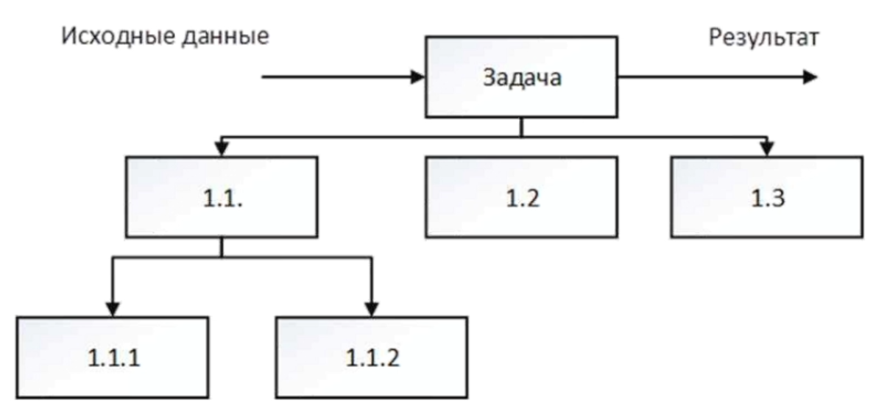

IPO - диаграмма (Input - Processing - Output: Ввод- Обработка - Вывод) должна соответствовать каждому узлу предыдущей диаграммы
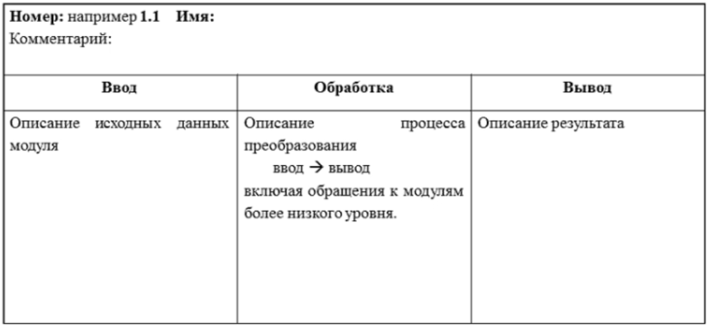


####  Анализ потоков данных
Немного устарел, но может быть использован, например, при автоматизации малых офисов.

Диаграмма потоков данных (DFD, Data Flow Diagram):

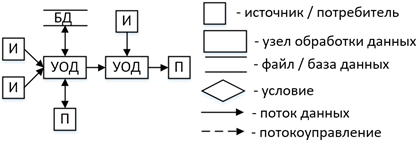

#### Объектно-ориентированный подход

**Объект** - это реально существующий предмет со всеми его индивидуальными особенностями.

**Класс** - это множество объектов с одинаковыми свойствами и одинаковым поведением

#### Agile-методики
**Принципы:**
1. Нашим наивысшим приоритетом является удовлетворение клиента посредством ранней и непрерывной поставки ценного программного обеспечения.
2. Приветствуем изменение требований, даже на поздних стадиях разработки.
3. Agile-процессы позволяют использовать изменения для обеспечения заказчику конкурентного преимущества.
4. Работающий продукт следует выпускать как можно чаще, с периодичностью от пары дней до пары месяцев.
5. На протяжении всего проекта разработчики и представители бизнеса должны ежедневно работать вместе.
6. Над проектом должны работать мотивированные профессионалы. Чтобы работа была сделана, создайте условия, обеспечьте поддержку и полностью доверьтесь им.
7. Непосредственное общение является наиболее практичными эффективным способом обмена информацией как с самой командой, так и внутри команды.
8. Работающий продукт - основной показатель прогресса.
9. Инвесторы, разработчики и пользователи должны иметь возможность поддержать постоянный ритм бесконечно. Agile помогает наладить такой устойчивый процесс разработки.
10. Постоянное внимание к техническому совершенству и качеству проектирования повышает гибкость проекта.
11. Простота - искусство минимизации лишней работы - крайне необходима.
12. Самые лучшие требования, архитектурные и технические решения рождаются у самоорганизующихся команд.
13. Команда должна систематически анализировать возможные способы улучшения эффективности и соответственно корректировать стиль своей работы.

**SCRAM-технология и экстремальное (ХР) программирование**
- Постоянное сотрудничество заказчика и разработчика, от постановки задачи до тестирования.
- Разработка маленькими шагами, результаты которых тут же тестируются и будут предъявлены заказчику.
- Пожелания заказчика по усовершенствованию по возможности тут же будут реализованы.
- Разработку ведет относительно малочисленная группа специалистов, которые друг другу полностью доверяют, могут договориться. Отсутствует руководитель проекта, который распределяет задания и проверяет их выполнение.

**Критерии применения гибких методик**

Важны два параметра: критичность и масштаб.

_Критичность_ определяется последствиями потери работоспособности программного
обеспечения. Выделены 4 уровня:
- `С` - потеря удобства.
- `D` - потеря восстанавливаемых ресурсов (материальных, финансовых).
- `Е` - потеря невосстанавливаемых ресурсов (материальных, финансовых).
- `L` - угроза техногенных катастроф.

Масштаб определяется количеством занятых в разработке специалистов:
- 1 - 6: малый,
- 7 - 20: средний,
- Более 20: большой.
-
Гибкие методики могут применяться при критичности С и В и при малых и средних разработках.

## Жизненный цикл программного продукта. Основные понятия.

**Жизненный цикл** - это развитие системы, продукта, услуги, проекта или других изготовленных человеком объектов, начиная со стадии разработки концепции и заканчивая прекращением применения.
Другими словами можно сказать, что жизненный цикл программного обеспечения охватывает промежуток времени от возникновения необходимости в нем до завершения его эксплуатации.
При возникновении такой необходимости возникает и вечный вопрос: приобрести уже готовый продукт или разработать собственный.

#### Процессы жизненного цикла
1. Процесс анализа требований (функциональных и нефункциональных) к программным средствам
2. Процесс проектирования архитектуры программных средств - разработка общих принципов построения.
3. Процесс детального проектирования программных средств - из каких компонентов будет состоять, какие будут базы данных
4. Процесс конструирования программных средств - написание текстов программ и локальная отладка
5. Процесс комплексирования программных средств - сборка всех компоненов и проверка их работоспособности.
6. Процесс квалификационного тестирования программных средств - заключительное тестирование проводит не автор программы
  - _альфа_ - внутри компании разработчика, но без участия разработчиков
  - _бета_ - использование потенциальными пользоваетелями некоммерческой версии программы
7. Поставка и внедрение (использование программы без присутствия разработчика)
  - Опытная эксплуатация - работают разработчик и пользоваетль.
  - Промышленная эксплуатация - программа работает в реальных условиях без постоянного пристутствия разработчика.
8. Сопровожение программного продукта
  - устранение выявленных ошибок, внесение изменений, вызванных внешними факторами,
  - накопление предложений для разработки следующей версии,
  - внесение непринципиальных усовершенствований,
  - организованный переход к следующей версии с минимальными затратами

**Укрупненная модель жизненного цикла** (разработка небольших программных средств)
- анализ требований (превращение прикладной задачи в программистскую)
- проектирование структуры;
- программирование, тестирование, отладка;
- сборка, валидация, верификация (+ на этом этапе надо убедиться, что программа удовлетворяет требованиям, определенным на первом этапе)
- внедрение;
- сопровождение.

**Валидация** (validation): подтверждение того, что требования, предназначенные для конкретного использования или применения, выполнены. Валидация представляет собой совокупность действий, гарантирующих и обеспечивающих уверенность в том, что система способна реализовать свое предназначение, текущие и перспективные цели.

**Верификация** (verification): подтверждение того, что заданные требования полностью выполнены. Верификация представляет собой совокупность действий по сравнению полученного результата жизненного цикла с требуемыми характеристиками для этого результата.

## Модели жизненных циклов программного обеспечения, их характеристики и области применения.

В ходе реализации разработчик должен определить модель жизненного цикла, соответствующую области применения, размерам и сложности проекта. Модель жизненного цикла должна содержать стадии, цели и выходы каждой стадии. Виды деятельности и задачи процесса реализации программных средств должны быть выбраны и отражены в модели жизненного цикла. Эти виды деятельности и задачи могут пересекаться или взаимодействовать друг с другом, могут выполняться итеративно или рекурсивно.

Модель жизненного цикла показывает как между собой связаны этапы разработки программного обеспечения.

**Каскадная модель - водопад**

Особенности: полностью отсутствуют обратные связи (каждый этап считается полностью законченным до перехода к следующему), что упрощает процесс разработки, но является слишком жёстким требованием для реализации сложных проектов; ошибка, допущенная на этапе анализа, пересекает весь проект, и исправлять её сложно.

По этой модели можно работать в 2 случаях: разработка очередной версии существующего ПО; реализация простого проекта опытным разработчиком.

Устранение ошибок, допущенных на ранних этапах обойдется намного дороже исправления ошибок, допущенных на более поздних

Источник - статья У.Ройса 1970 года, из которой эта модель была выделена по ошибке.

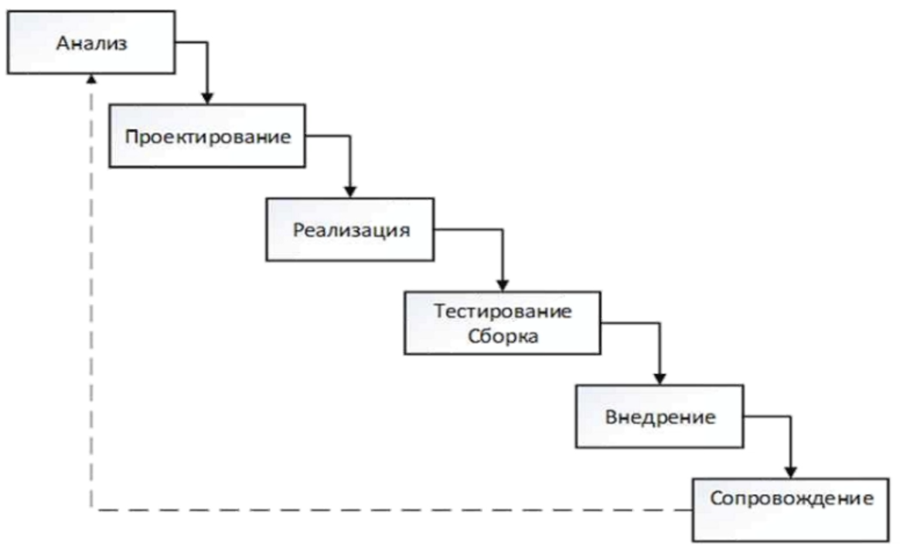


## Особенности модели жизненного цикла «спираль»

Особенности: Раскручивается версия за версией, постепенно расширяется функционал. В идеале расширение аддитивное (внесение нового, без изменения старого).

Проблема: Успех разработки в большой степени определяется тем, в какой последовательности выбрана реализация. Основной принцип - как в строительстве: сначала фундамент (то есть общие части) и т.д. То есть при получении задачи нужно узнать, какие нужно накапливать данные, чтобы развивать данную задачу.

Применяется регрессионное тестирование, то есть в начале нужно провести тесты, предназначенные для предыдущей версии.

Предпроектное исследование - анализ рисков - принятие решения - разработка первой версии (м.б. прототипом) - анализ рисков (результатов)...

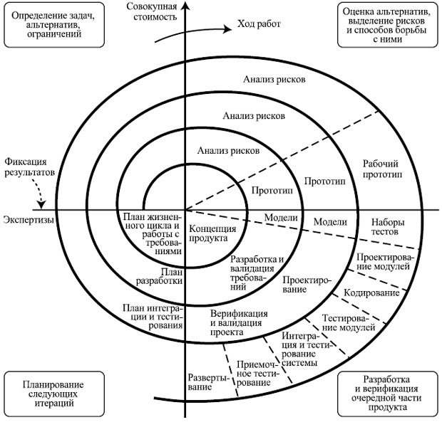

## Методы «быстрой разработки» их суть и условия применения.

Быстрая разработка приложений (RAD, rapid application development) - это жизненный цикл процесса проектирования, созданный для достижения более высокой скорости разработки и качества ПО и более низкой стоимости разработки, чем это возможно при традиционном подходе к проектированию.

Технологию RAD целесообразно применять, если:
-  Необходимо выполнение проекта в сжатые сроки.
-  Нечетко определены требования к ПО.
-  Проект выполняется в условиях ограниченности бюджета.
-  Интерфейс пользователя главный фактор.
-  Возможно разбиение проекта на функциональные компоненты.
-  Низкая вычислительная сложность ПО.

Основные принципы RAD:
- Работа ведется группами (руководитель, аналитик, два программиста, технический писатель) Если проект сложный, то для него может быть выделено несколько RAD-групп. Разработка проекта выполняется в условиях тесного взаимодействия между разработчиками и Заказчиком.
- Разработка базируется на моделях. Моделирование позволяет оценить проект и выполнить его декомпозицию на составные части, каждая из которых может разрабатываться отдельной RAD-группой.
- Итерационное прототипирование. Разработка системы и предъявление ее заказчику осуществляется в виде последовательности развиваемых прототипов. Любой из прототипов реализует определенную часть функциональности, требуемой от конечного продукта. При этом каждый последующий прототип включает всю функциональность, реализованную в предыдущем прототипе, с добавлением новой. Традиционно для проектов ПО средней сложности разрабатываются три прототипа. Первый содержит весь пользовательский интерфейс с нулевой функциональностью. Второй прототип содержит реализованную на 70-80% функциональность системы, третий – полностью реализованную функциональность.
- RAD группа всегда работает только над одним прототипом.
- Если проект сложный, то для него может быть выделено несколько RAD групп.
- Обязательное использование инструментальных средств, автоматизирующих процесс разработки, и методик их использования, следствием чего является сокращение сроков разработки и повышение качества конечного продукта.


## Планирование разработки программного обеспечения. LOC и FP-метрики. СОСОМО модель.

**План разработки программного обеспечения** (план проекта). План определяет _порядок работ, ресурсы, обязанности,_ и так далее. Может быть как маленьким и относительно неформальным так и большим и полностью официальным. Создание плана проекта столь же важно, как и само проектирование кода.

Процесс руководства программным проектом начинается с множества действий, объединяемых общим названием **планирование проекта**. Первое из этих действий - **_выполнение оценки_**. Очень важно провести оценку с минимальным риском.

Цель выполнения оценки проекта на основе LOC- и FP-метрик - сформировать предварительные оценки, которые позволят:
- предъявить заказчику корректные требования по стоимости и затратам на разработку программного продукта;
- составить план программного проекта.
При выполнении оценки возможны два варианта использования LOC- и FP-данных:
- в качестве оценочных переменных, определяющих размер каждого элемента продукта;
- в качестве метрик, собранных за прошлые проекты и входящих в метрический базис фирмы.


#### LOC и FP-метрики.

**Размерно-ориентированные метрики** прямо измеряют программный продукт и процесс его разработки. Основываются размерно-ориентированные метрики на LOC-оценках (Lines Of Code). LOC-оценка — это количество строк в программном продукте.

Достоинства размерно-ориентированных метрик (основываются на LOC - lines of code):
- широко распространены;
- просты и легко вычисляются.

Недостатки размерно-ориентированных метрик:
- зависимы от языка программирования;
- требуют исходных данных, которые трудно получить на начальной стадии проекта;
- не приспособлены к непроцедурным языкам программирования.

**Функционально-ориентированные метрики** косвенно измеряют программный продукт и процесс его разработки. Вместо подсчета LOC-оценки при этом рассматривается не размер, а функциональность или полезность продукта. Используется 5 информационных характеристик для подсчета FP (Function Points):
- Количество внешних вводов
- Количество внешних выводов
- Количество внешних запросов
- Количество внутренних логических файлов
- Количество внешних интерфейсных файлов

После сбора всей необходимой информации приступают к расчету метрики — количества
функциональных указателей.

Достоинства функционально-ориентированных метрик: не зависят от ЯП, легко вычисляются на любой стадии проекта.

Недостаток функционально-ориентированных метрик: результаты основаны на субъективных данных, используются не прямые, а косвенные измерения.

**COCOMO** - Constructive Cost Model (модель издержек разработки). Оценка стоимости программного продукта.


## Виды контроля программ; статические и динамические методы контроля. Тестирование  и отладка.

#### Виды контроля программ
- визуальный контроль - чтение программы (проверка условий в условных операторах и цаклах, возможность не завершения итерационных циклов и т.д.)
- Статический контроль – проверка программы по ее тексту без выполнения с помощью инструментальных средств. Синтаксический контроль выполняется компилятором.
- Динамический контроль – проверка правильности программы и ее выполнение на компьютере.

[Еще](https://life-prog.ru/view_ppdkss.php?id=18)

#### Тестирование  и отладка.
Тестирование — это запуск программы на разных наборах исходных данных — тестах и анализ полученных результатов с целью обнаружения ошибок.

Заключительное тестирование проводит не автор программы.

Виды тестирования:
- _альфа-тестирование_ - внутри компании разработчика, но без участия разработчиков
- _бета-тестирование_ - использование потенциальными пользоваетелями некоммерческой версии программы

Отладка - выявление причин некорректного поведения программы и их устранение.

## Методы функционального тестирования.

Функциональное тестирование является одним из ключевых видов тестирования, задача которого — установить соответствие разработанного программного обеспечения исходным функциональным требованиям заказчика. Проведение функционального тестирования — процесс, позволяющий проверить способность информационной системы работать в определенных условиях и решать задачи, нужные пользователям.

#### Метод эквивалентного разбиения.

Множество значений исходных данных разделяют на непересекающиеся подмножества таким образом, чтобы внутри каждого подмножества все значения были равносильны в качестве теста, но значения из разных подмножеств — нет.

Правильный класс эквивалентности — это допустимые значения исходных данных, неправильный класс эквивалентности — недопустимые значения. Например, для функции `у = ln(x)` допустимым классом эквивалентности является `x>0`, недопустимым `x<=0`.

#### Метод граничных значений.

Этот метод требует использовать в качестве тестов значения на границах и около границ классов эквивалентности.

Для уменьшения количества тестов рекомендуют использовать эти два метода совместно: сначала составить тесты по эквивалентному разбиению, а затем подкорректировать их таким образом, чтобы соблюдались рекомендации второго метода.

## Методы структурного тестирования. Граф управления программы. Тестирование путей, цикломатическая сложность программы.

В любой программе присутствуют три базовых конструкции: последовательность, выбор и повторение (цикл). Последовательности в графе управления можно ставить в соответствие одну вершину или столько вершин, сколько действий имеется в последовательности. Любой повтор (цикл) может быть реализован через выбор. Оператору цикла ставится в соответствие столько вершин графа, сколько условий продолжения (прерывания) цикла.

Для тестирования «белого ящика» необходимо пропускать столько тестов, сколько путей имеется на графе управления.

Интерпретация: цикломатическая сложность — это количество путей от первой вершины до последней.

Цикломатическая сложность программы определяется по формуле `Количество_ребер - количество_вершин + 2`. Цикломатическая сложность последовательности всегда равна единице. Поэтому можно при составлении графа управления программой последовательность представить одной вершиной.

Пример графа управления для следующего фрагмента:
```cpp
x = 3.4;
z = x * y;
if (z > 7.2) n++;
else m++;
y = z * n;
```
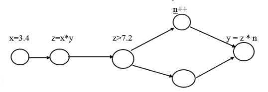

## Совместное использование функционального и структурного тестирования.

Тестирование «серого ящика»:
1. На основе спецификации программы составим тесты методами «черного ящика». Допустим, получили N тестов.
2. Пусть на графе управления существует M путей.

Возможны следующие случаи:
1. `N = M` и составленные тесты обеспечивают прохождение всех путей по меньшей мере по одному разу. Все хорошо!
2. `N = M`, но обеспечивается прохождение лишь K путей (K < M). Если оставшиеся М-К путей противоречивые, то два или более теста будут пройдены по одному и тому же пути. Если это так и должно быть, то можно, в принципе, уменьшить количество тестов, но вполне возможно, что этого не стоит делать! Если так не должно быть (два теста пройдут по одному пути, но на самом деле они разные) — значит в программе ошибка!
3. `N = M`, но обеспечивается прохождение лишь K путей (K < M), среди оставшихся М-К путей имеются реальные, то не все протестировано и количество тестов надо увеличить.
4. `N < M`. Если оставшиеся М-N путей противоречивые, то все хорошо, можем приступить к тестированию, но если это не так, то придется составить и для них тесты.
5. `M < N`, значит, два или более теста пройдут по одному и тому же пути. Если так и должно быть, то некоторые случаи будут протестированы повторно. Если нет, то два разных случая пройдут по одному и тому же пути и в программе ошибка.

## Тестирование программных комплексов, построенных методом функциональной декомпозиции

[Тут про сам метод](#метод-функциональной-декомпозиции)

1. **_Монолитное_** тестирование. Все составные части тестируются независимо друг от друга, и после завершения этого выполняется сборка всего комплекса. Такую сборку иногда называют» «большой скачок».
2. **_Пошаговое_** (или **_инкрементное_**) тестирование, где протестированные модули тут же подключают к комплексу, тестирование и сборка выполняются параллельно. Пошаговое тестирование может выполняться сверху — вниз, когда первым тестируется главный модуль, затем вызываемые им модули и так далее до нижнего уровня.

При монолитном тестировании приходится почти для всех модулей разрабатывать как драйверы, так и заглушки, но благодаря этому можно каждый модуль всесторонне протестировать и можно распараллелить работу. Принципиальный недостаток: совсем не проверяются межмодульные интерфейсы, поэтому и сборка тестированных таким способом модулей называется «большой скачок», и найти места неправильно работающих интерфейсов часто весьма трудно.

При пошаговом тестировании при подключении нового модуля кроме его самого проверяется и его интерфейс. В ходе тестирования вновь подключенных модулей дополнительно протестируются и ранее подключенные. При этом тестирование не обязательно проводить уровень за уровнем, можно выделить часть модулей, которые обеспечивают решение значительной части, например, 75% задач, и начинать их внедрение, предупредив пользователя, что пока часть задач не решается. В ходе использования программный комплекс проходит дополнительную проверку по многим критериям.

## Тестирование программ и жизненный цикл программного продукта.

МБ тут надо про методы проверки?? (6.1 пособия от Марана стр 160)

Тестирование примитивных программ (?)
Примитивными считаем программы, не содержащие вызовов функций. Рекомендуется, чтобы объем такой программы не превышал 1–2 экрана. Существуют два подхода их тестирования:
- Тестирование «черного ящика», равнозначные термины: функциональное тестирование, тестирование по данным.
- Тестирование «белого ящика», равнозначные термины: тестирование по управлению, структурное тестирование. Некоторые авторы говорят еще о тестировании «серого ящика», подразумевая под этим совместное применение обоих подходов.
- Метод функциональных диаграмм (метод причинно-следственных связей)
- Предположение об ошибке (на основе опыта тестировщик предполагает где какие ошибки могут быть и нацеливает туда проверки)

[Тут про жизненный цикл](#жизненный-цикл-программного-продукта-основные-понятия)

## Общая характеристика и назначение языка UML.

UML - Unified Modelling Language (универсальный язык моделирования) - это язык графического моделирования, широко применяемый при разработке программных средств по объектно-ориентированной методике. Предназначен для выполнения этапов анализа и проектирования программных средств.

С помощью языка UML можно выполнять следующие задачи:
- описание требований к разрабатываемой системе;
- описание структуры и бизнес-процессов предметной области;
- проектирование архитектуры программного продукта;
- проектирование размещения программного продукта в сети;
- генерация структуры объектно-ориентированной программы.

UML — это язык диаграмм.
Классификация диаграмм:
1. Структурные диаграммы:
  - диаграмма классов (Class Diagram);
  - диаграмма компонентов (Component Diagram);
  - диаграмма размещения (Deployment Diagram).
2. Диаграммы поведения:
  - диаграмма вариантов использования (Use Case Diagram);
  - диаграмма деятельности (Activity Diagram);
  - диаграмма состояний (State Machine Diagram);
  - диаграммы взаимодействия (Interaction Diagram):
    - диаграмма коммуникации (Communication Diagram);
    - диаграмма последовательностей (Sequence Diagram).

## Диаграммы вариантов использования, назначение, компоненты, отношения между компонентами.

**Назначение**

Предназначена для документирования требований к разрабатываемому программному продукту. Она показывает, кто является потенциальными пользователями и для решения каких задач они могут в будущем обращаться к создаваемому программному продукту.

Главное назначение диаграммы вариантов использования заключается в формализации функциональных требований к системе с помощью действующих лиц — потенциальных пользователей и вариантов использования — задач, с которыми они будут обращаться к разрабатываемому программному продукту.

**Компоненты**

Основными компонентами диаграммы вариантов использования являются действующие лица (в литературе используют равнозначные термины − актер, актант), варианты использования (равнозначный термин — прецедент) и отношения между ними.

**Отношения**

На диаграмме вариантов использования могут быть применены (и показаны на ней) следующие виды отношений:
- отношение ассоциации (association relationship)
- отношение расширения (extend relationship);
- отношение включения (include relationship);
- отношение обобщения (generalization relationship).

Отношение **ассоциации** используется для задания взаимодействия действующего лица и вариантов использования: какое действующее лицо какие варианты использует.
- Отсутствие стрелки - действующее лицо запускает вариант использования, и результат передается ему же.
- Стрелка, направленная от действующего лица - лицо запускает вариант, но результат ему не передается (за исключением сообщения типа «Выполнено»)
- Стрелка от варианта использования - действующее лицо не может запускать вариант, ему лишь сообщают результат, если этот вариант был кем-то запущен.

Отношение **расширения** используется между вариантами использования: оно указывает, что один вариант расширяет возможности другого, но это расширение не имеет обязательного характера, а предоставляет дополнительные возможности, которые потребуются не всегда (например, подзадача, которая
может возникнуть или нет).

Отношение **включения** показывает, что один вариант использования всегда включает и другой вариант использования (например, как подзадачу, которую придется всегда решить).

Отношение **обобщения** связывает менее общее с более общим.

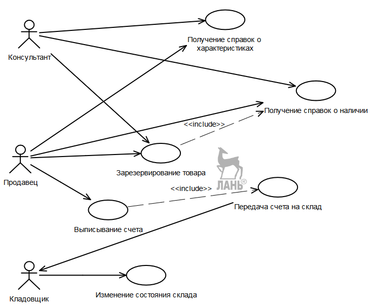

## Диаграмма последовательности и кооперативная диаграмма, их назначение, компоненты.

#### Диаграмма последовательности
Каждому варианту использования должна соответствовать диаграмма последовательностей, которая отражает последовательность обмена сообщениями именно для этого варианта. Исполнение многих вариантов использования может протекать по-разному в зависимости от обстоятельств, например резервирование товара в случае наличия или отсутствия требуемого количества. Диаграмма последовательности служит, в первую очередь, для визуализации временных аспектов взаимодействия.

**Сообщение** (message) представляет собой законченный фрагмент информации, который отправляется одним объектом другому (обращение из одного объекта к методу в составе другого объекта).

При подаче **синхронного** сообщения процесс может продолжаться лишь после получения ответа от адресата. При **асинхронном** сообщении процесс продолжается сразу послеего отправки.

У верхнего края диаграммы на горизонтальной линии находятся **_объекты_**, которые существуют с самого начала работы программы. **_Линия жизни_** объекта изображается _пунктирной вертикальной линией_. Эта линия служит для обозначения периода времени, в течение которого объект существует и может участвовать в обмене сообщениями. Очевидно, что для создания объекта должен быть запущен конструктор его класса, а также даны значения некоторому подмножеству его данных. Следует также иметь в виду, что один объект может передать сообщение другому лишь тогда, когда среди его данных имеется адрес того. Для явного выделения состояния объекта применяется **_фокус управления_**, который изображается в форме _вытянутого узкого прямоугольника_, верхняя сторона которого обозначает начало активности, а нижняя сторона − ее конец.

Сообщения показаны на диаграмме горизонтальными линиями. Имеются следующие стереотипы сообщений:
- Call (вызвать) — сообщение, требующее вызова метода класса- адресата. Это сообщение может быть рефлексивным, тогда оно требует вызова метода в классе-отправителе;
- Return (возвратить) — возвращает результат выполнения сообщения Вызвать;
- Create (создать) — сообщение, требующее создание другого объекта;
- Destroy (уничтожить) — сообщение с требованием уничтожения объекта-адресата.

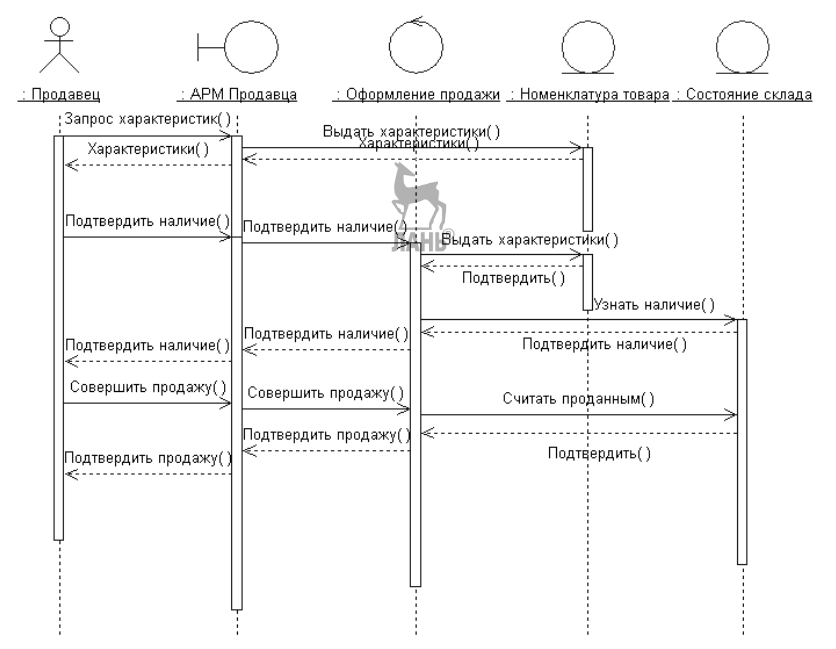

#### Диаграмма кооперации
Диаграмма кооперации служит для представления структурных аспектов.

Наличие _сплошной линии_ между объектами показывает, что между ними могут передаваться сообщения. Сами сообщения показаны рядом с линиями. _Цифры у сообщений_ показывают очередность их возникновения. Рядом с сообщениями может быть указан метод класса адресата. На основе диаграммы последовательности кооперативная диаграмма может быть создана автоматически.

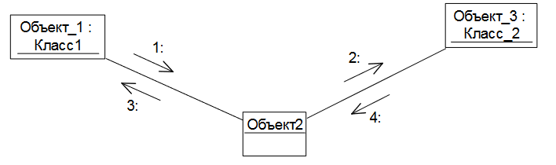

## Диаграмма классов, характеристики класса

Диаграмма классов служит для представления **_статической структуры модели системы_** в терминологии объектно-ориентированного программирования. Диаграмма классов отражает структуру отдельных классов и их взаимосвязи и состоит из классов и отношений между ними.

**Название класса** должно быть уникальным в пределах модели, они образуют в будущем словарь предметной области

**Атрибуты** (или свойства) класса задают набор его характеристик.

**Операции** класса задают услуги, которые могут быть запрошены у любого объекта данного класса. Операциями заданы задачи, которые могут быть решены на объектах данного класса.

Стереотипы
- Действующее лицо (Actor)
- граничный класс (Boundary) используется для задания взаимодействия разрабатываемого программного продукта с внешней средой. Поэтому каждому действующему лицу должен соответствовать граничный класс.
- Сущность (Entity) используется для классов, предназначенных для создания баз данных
  - Сущность Управление (Control) предназначена для управления работой программного продукта.

Все стереотипы классов имеют одинаковую структуру, рассмотренную нами выше: название, атрибуты, операции.

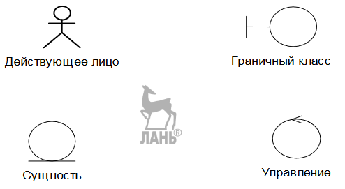

## Диаграмма классов, типы и характеристики отношений между классами.

Между классами имеются следующие отношения:
- обобщения (generalization);
- ассоциации (association);
- зависимости (dependency);
- реализации (realization).

**Отношение обобщения** связывает класс, соответствующий более общему понятию (предок), с менее общими понятиями − классами (потомками). Равносильные термины родительский класс — дочерний класс.

**Отношение ассоциации** показывает наличие содержательной связи между двумя классами. Разновидности: **агрегации** (один класс содержит в какой-то ситуации в своем составе другие классы, но они могут существовать и независимо друг от друга.) и **композиции** (отношение «целое — часть», то есть составные части не имеют смысла без своего владельца)

**Отношение зависимости** определяет, что изменение одного класса может повлиять на другой класс, который его использует, причем обратное в общем случае неверно.

**Отношение реализации** задается между классами, один из которых описывает действия, а другой гарантирует их выполнение. Чаще всего реализации используют для определения отношений между интерфейсом и классом, который предоставляет объявленные в интерфейсе операции или услуги. Интерфейс позволяет отделить спецификацию (сам интерфейс) от реализации.

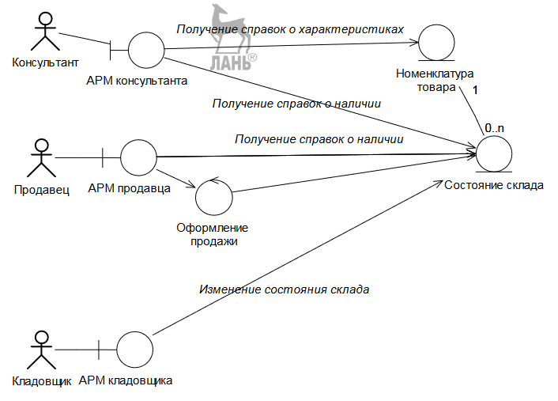

## Диаграмма состояний: назначение, компоненты.

**Назначение**

Будем говорить о состояниях классов, подразумевая при этом, что все объекты этого класса будут находиться в одинаковых состояниях. Переход объектов класса из одного состояния в другое задает характерные черты их поведения.

Она позволяет лучше понимать функционирование исследуемой системы. Если какой-либо класс имеет ярко выраженное динамическое поведение, то разработка этой диаграммы желательна.

**Компоненты**

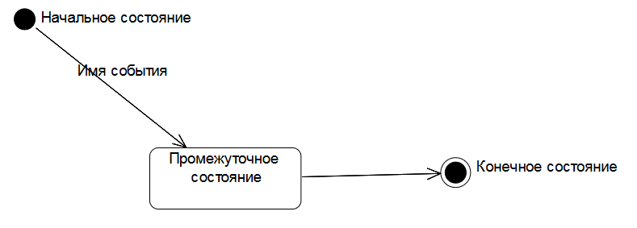


## Диаграмма деятельности: назначение, компоненты.

**Назначение**

Диаграммы деятельности предназначены для моделирования поведения, иногда их называют «ОО блок-схемы». Например, с их помощью можно описать работу варианта использования. Действие — это элементарная работа, не подлежащая дальнейшей детализации.

**Компоненты:**
- действие
- проверка условия
- конец разветвления (обязательно, если есть начало)
- линия синхронизации (следующие за ней
действия могут выполняться одновременно, но все они должны быть выполнены)
- сигнал (завершение действия передается за пределы системы)
- прием сигнала (ожидание сигнала со стороны)
- узел соединения (можно двигаться дальше лишь при условии, что все параллельно выполняемые ветви завершились, не обязательно одновременно)

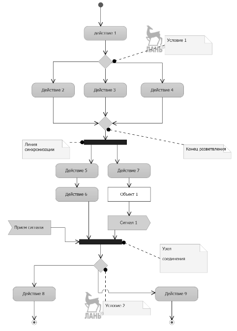

## Диаграммы компонентов и размещения, их назначение, компоненты.

#### Диаграммы компонентов
Диаграмма компонентов описывает особенности физического представления создаваемой системы. Компонент — это модульная и замещаемая часть системы, который взаимодействует с другими компонентами через строго определенный интерфейс. Замена одного компонента на другой с таким же интерфейсом и функционалом не должна влиять на работу системы в целом.

Все классы должны содержаться в компонентах. Другими словами, компоненты состоят из классов.

#### Диаграммы размещения
Диаграмма развертывания (размещения) показывает какие компоненты на каких компьютерах работают и как эти компьютеры связаны.

Компоненты (?)

## Унифицированный процесс разработки программных средств. Общая характеристика и этапы. Основополагающие принципы разработки  программных средств по унифицированному процессу.

Фундаментальные принципы унифицированного процесса (в дальнейшем УП) заключаются в следующих утверждениях:
- УП управляется вариантами использования;
- УП является архитектурно-ориентированным;
- УП является итеративным и инкрементным.

**_Пользователь_** — это нечто внешнее относительно создаваемого программного продукта. Пользователь обращается к программному продукту со своими задачами и ждет от него определенной последовательности действий. Такое взаимодействие является вариантом использования. **_Вариант использования_** — это часть функциональности системы, необходимая для получения пользователем значимого результата.

Понятие архитектура программного продукта включает в себя наиболее важные статические и динамические его аспекты. **_Архитектура_** — это представление всего проекта с выделением важных характеристик и затушевыванием деталей. Варианты использования определяют функции, а архитектура - форму. На основе анализа ключевых вариантов использования разрабатывается архитектура создаваемого программного продукта, которая в ходе дальнейшей работы над проектом должна расширяться и дополняться, но не переделываться кардинальным образом.

Разработка разделяется на относительно небольшие части, так называемые _мини-проекты_. Каждый мини-проект является **_итерацией_**, результатом которой будет приращение (**_инкремент_**). Итерации относятся к процессу разработки, а приращения — к выполняемому проекту.


Фазы:
- фаза анализа (идея превращается в концепцию готового продукта и создается план его разработки)
- фаза проектирования (детально описывается большинство вариантов использования и разрабатывается архитектура системы)
- фаза реализации (создание продукта)
- фаза внедрения (бета-версия продукта)


## Процесс определения требований к программным средствам. Документирование требований с помощью диаграмм. Функциональные и нефункциональные требования.

Цель определения требований − ответить на вопрос, что должно делать создаваемое программное обеспечение для каждого потенциального пользователя?

Типовой рабочий процесс определения требований включает следующие тесно взаимосвязанные шаги:
- перечисление возможных требований;
- описание контекста системы;
- определение функциональных требований;
- определение нефункциональных требований.

(?) Что про диаграммы? Составление диаграммы вариантов использования?

Функциональные - какие задачи должна решать программа. Их определение заключается в разработке модели вариантов использования.

Нефункциональные - какими характеристиками должна обладать программа.

В результате выполнения работ по определению требований должны быть получены (программа-минимум):
1. Описание контекста системы.
2. Модель вариантов использования (одна или несколько диаграмм).
3. Эскизы интерфейсов пользователей для всех действующих лиц.
4. Описания вариантов использования.
5. Основные нефункциональные требования.

## Особенности тестирования программных средств, построенных по объектно-ориентированной методике. Тестирование классов.

Основной моделью жизненного цикла программного обеспечения, разрабатываемого по объектно-ориентированной методике, является спираль. Поэтому важно проверить при добавлении новых возможностей, выполняются ли корректно те задачи, которые уже были реализованы в предыдущих версиях. Это называется регрессионным тестированием. **_Регрессионное тестирование_** заключается в том, что перед проверкой работы новых возможностей мы запустим тесты, на которых проверили предыдущую версию.

[Про спираль](#особенности-модели-жизненного-цикла-спираль)

Различают:
- Тестирование примитивных классов
- Тестирование взаимодействия классов
- Тестирование иерархии классов

#### Тестирование примитивных классов
Класс называется примитивным, если он только принимает сообщения и не создает динамически экземпляры других классов. Так как в классе могут содержаться приватные поля, при тестировании их можно сделать публичными, а после - вернуть окончательные атрибуты доступа.

## Тестирование взаимодействия классов. Контрактное и защитное программирование. Тестирование иерархии классов.

#### Контрактное и защитное программирование.

При **контрактном** подходе выполнение предусловий (условие, которое должно быть выполнено перед операцией, в противном случае операция не может быть выполнена) обеспечивают вместе отправитель и получатель. Отправитель должен обеспечить принадлежность исходных данных допустимым классам эквивалентности. Но в общем случае это является достаточным, но не необходимым условием успешного выполнения функции. Например, требуется 2 билета на определенный рейс. Все данные корректные, но билетов может не быть. Если корректность исходных данных достаточное условие для выполнения функции — то этот вопрос не стоит.

_Вывод для тестирования:_ при контрактном подходе тестирование на неправильных классах эквивалентности не требуется.

При **защитном** программировании гарантии корректности исходных данных нет, и функция сама должна обеспечить, чтобы «мусор на входе не превратили мусором на выходе». Допустимы оба подхода, но тесты должны разрабатываться с учетом применимого подхода.

#### Тестирование взаимодействия классов.
Сообщения, получаемые пассивным классом, можно разделить на две категории:
- сообщения, полностью обрабатываемые этим классом (применяют регрессионное тестирование и тестирование примитивного класса)
- сообщения, которые вызывают отправку сообщения другому классу (применяют тестирование, похожее на тестирование модулей промежуточных уровней при функциональной декомпозиции)

При применении контрактного программирования должно быть установлено, что никакая функция при допустимых классах эквивалентности на входе не порождает недопустимых классов на выходе.

Хорошим помощником при составлении тестов для тестирования взаимодействия классов являются _диаграммы последовательностей_, которые показывают реализацию вариантов использования со всеми возможными альтернативными путями. Все возможные пути их реализации должны быть протестированы.


#### Тестирование иерархии классов.
Выполняется от класса-предка к наследникам. Класс-наследник содержит все данные класса-предка (кроме закрытых) и может пользоваться функциями-членами класса-предка (кроме закрытых). При отправлении сообщения классу-наследнику существуют два варианта: оно будет обработано функцией-членом класса или наследованной функцией. Если наследованная функция уже протестирована при тестировании класса-предка, то таким образом можно уменьшить объем тестирования. Но при этом надо обратить внимание на виртуальные функции: имеют ли они новую реализацию в классе-наследнике или нет. Принцип простой: следует тщательно следить за тем, чтобы ВСЕ реализации виртуальных функции были полностью протестированы.

Другая проблема заключается в тестировании абстрактных классов.  Можно использовать два подхода:
1. Заменить на время тестирования такого класса абстрактную функцию заглушкой.
2. Закомментировать абстрактную функцию на время тестирования и проводить тестирование ее реализации только при тестировании классовнаследников.


## Сравнение объектно-ориентированного и процедурного программирования.

#### Процедурное программирование

Процедурное программирование — программирование на императивном языке, при котором последовательно выполняемые операторы можно собрать в подпрограммы, то есть более крупные целостные единицы кода, с помощью механизмов самого языка. Основная идея процедурного программирования - использование памяти для хранения данных. Основная команда- присвоение, с помощью которой определяется и меняется память компьютера. Программа производит преобразование содержимого памяти, изменяя его от исходного состояния к результирующему.

В процедурной программе модули взаимодействуют посредством состояния чтения и записи, которое хранится в общих структурах данных.

#### Объектно-ориентированное программирование

В объектно-ориентированной программе модули в виде объектов взаимодействуют путем отправки сообщений другим объектам.

Базовые принципы:
- Объект - базовая единица объектно-ориентированной системы.
- Посылка сообщений - единственный способ обмена информацией между объектами.
- Каждый объект относится к какому-то классу.
- Поведение объекта определяется его классом.
- Классы наследуют функциональность от предка.

Парадигмы ООП:
- инкапсуляция (объединение данных и функций, которые управляют этими данными, в единый компонент)
- наследование (механизм языка, позволяющий описывать новый класс на основе существующего)
- полиморфизм (свойство системы использовать объекты с одинаковым интерфейсом без информации о типе и внутренней структуре объекта)
- *абстракция (предствление объекта минимальным набором полей и методов)
- *посылка сообщений (вызов объектом метода другого объекта)


## Лямбда-выражения на С++, их назначение, использование/ Организация обмена данными между лямбда-выражениями и основной программой на С++
Удобный способ определения объекта анонимной функции прямо в расположении, где оно вызывается или передается в качестве аргумента функции.

## Объявление классов на C#.
```cs
class Example
{
public:     /* ... */
protected:  /* ... */
private:    /* ... */
public Example();
~Example();
}
```

## Особенности использования формальных и фактических параметров в функциях C# (out, ref). Составление процедурных программ.
Типы параметров:
- По значению (без спецификаторов)
- По ссылке (ref, пишется и в месте вызова)
- Выходные (out, как ref, только обязывает к инициализации)

Составление процедурных программ = разбиение задачи на шаги, определение входных и выходных параметров

## Наследование на C#, работа с конструкторами при наследовании.
Столп ООП, позволяет создавать новые классы, которые повторно используют, расширяют и изменяют поведение, определенное в базовых классах (= суперклассах).
Недоступно множественное наследование (исключение: интерфейсы). При создании дочернего класса сначала неявно вызывается конструктор родительского. Сами конструкторы не наследуются.

base - вызов конструктора базового класса, соответствующего переданным параметрам
```cs
class Base
{
public Base(int);
public Base(String);
}

class Derived : Base
{
    public Derived(int i)
        : base(i)
}
```

## Индексаторы на C#.
Индексаторы позволяют индексировать объекты и обращаться к данным по индексу. C помощью индексаторов мы можем работать с объектами как с массивами.
```cs
возвращаемый_тип this [Тип параметр1, ...]
{
    get { ... }
    set { ... }
}
```

## Свойства на C#.
Обеспечивают простой доступ к полям классов и структур, позволяют узнать их значение или выполнить их установку.
```cs
[модификаторы] тип_свойства название_свойства
{
    get { return /* member */ }
    set { /* member */ = value }
}
```
Свойство может не иметь get или set. Можно применять модификаторы доступа не только ко всему свойству, но и к отдельным блокам get и set. Свойства могут генерироваться автоматически для полей класса:
```cs
public int member { get; set; }
```

## Делегаты на C#.
Делегаты представляют такие объекты, которые указывают на методы. То есть делегаты - это указатели на методы и с помощью делегатов мы можем вызвать данные методы. Делегат содержит список методов, можно добавить туда больше чем 1 метод (оператор +=).
```cs
void Hello() => Console.WriteLine("Hello");
void World() => Console.WriteLine("World!");

delegate void Message();

Message msg = Hello;
msg += World;
msg();
```

## Интерфейсы на C#.
Интерфейсы определяют некоторый функционал, не имеющий конкретной реализации, который затем реализуют классы, применяющие эти интерфейсы. Недоступность множественного наследования не касается интерфейсов - класс может наследовать несколько интерфейсов.
```cs
interface IMovable
{
    public const int minSpeed = 0;
    private static int maxSpeed = 60;
    public void Move();
    protected internal string Name { get; set; }
    public delegate void MoveHandler(string message);
    public event MoveHandler MoveEvent;
}
```

## Виртуальные методы и абстрактные классы на C#.
Аналогично C++
```cs
class Base {
public virtual void Foo();
}

class Derived : Base {
public override void Foo();
}
```

## Исключительные ситуации на C# и их использование для повышения качества программ
Функции обработки исключений в языке C# помогают справиться с непредвиденными или исключительными проблемами, которые возникают при выполнении программы.
Базовым классом для всех исключений является класс Exception. Обработка:
```cs
try { /* ... */ }
catch(Exception ex) { /* ... */ }
finally
{//выполняется после обработки исключения
}
```

## Класс  List на C#, создание и работа с классом List с нестандартными элементами. Применение языка LINQ.
Строго типизированный список объектов, доступных по индексу. Поддерживает методы для поиска по списку, выполнения сортировки и других операций со списками. Для работы с нестандартными элементами нужно выделить их в отдельную структуру данных.
```cs
Add(...);
Find(...);
Insert(...);
Remove(...);
this [...];
Sort(...);
ToArray(...);            // to array
List<T>(IEnumerable<T>); // from arary
```
Примеры LINQ запросов:
```cs
using System.Collections.Generic;
using System.Linq;

List<int> numbers = new List<int>() { 5, 4, 1, 3, 9, 8, 6, 7, 2, 0 };

IEnumerable<int> filteringQuery =
    from num in numbers
    where num < 3 || num > 7
    select num;

IEnumerable<int> orderingQuery =
    from num in numbers
    where num < 3 || num > 7
    orderby num ascending
    select num;

string[] groupingQuery = { "carrots", "cabbage", "broccoli", "beans", "barley" };
IEnumerable<IGrouping<char, string>> queryFoodGroups =
    from item in groupingQuery
    group item by item[0];
```

## Классы SortedList и  Dictionary на C#, создание и работа с ними  с нестандартными элементами Применение языка LINQ.
SortedList - предоставляет коллекцию пар "ключ-значение", упорядоченных по ключам. Доступ к парам можно получить по ключу и индексу. Внутренне поддерживает два массива для хранения элементов списка: для ключей и для связанных значений.
```cs
Add(...);
Contains(...);
GetByIndex(...);
this [...];
Remove(...);
GetKeyList(...);
GetValueList(...);
```

Dictionary - представляет коллекцию ключей и значений, реализуется как хэш-таблица.
```cs
Add(...);
ContainsKey(...);
ContainsValue(...);
TryAdd(...);
TryFetValue(...);
this [...];
```
```cs
using System.Collections.Generic;
using System.Linq;

/*
SortedList<String, int> sortedList = new SortedList<String, int>
*/
Dictionary<String, int> sortedList = new Dictionary<String, int>
            {
                {"One", 1 },
                {"Two", 2 },
                {"Three", 3 }
            };
            var tList = from l in sortedList
                        where l.Key.Length == 3
                        select l;
            foreach (KeyValuePair<String, int> pair in tList)
            {

            }
```

## Лямбда-выражения и их использование на LINQ. Операторы Select, Where, Take, Skip, TakeWhile, SkipWhile
Лямбда-выражения лежат в основе языка LINQ, пример:
```cs
using System.Linq;
/* input => pass condition */
int[] numbers = { 1, -1, 3, 5, 0 };
var positive = numbers.Where(n => n > 0);
```

Select - проецирует каждый элемент последовательности в новую форму
```cs
IEnumerable<int> squares = Enumerable.Range(1, 10).Select(x => x * x);

string[] fruits = { "apple", "banana", "mango", "orange", "passionfruit", "grape" };
var query = fruits.Select((fruit, index) => new { index, str = fruit.Substring(0, index) });
```

Where - фильтрует последовательность значений на основе заданного предиката
```cs
int[] numbers = { 0, 30, 20, 15, 90, 85, 40, 75 };
IEnumerable<int> query = numbers.Where((number, index) => number <= index * 10);
```

Take - возвращает диапазон элементов из последовательности
```cs
int[] grades = { 59, 82, 70, 56, 92, 98, 85 };
IEnumerable<int> topThreeGrades = grades.OrderByDescending(grade => grade).Take(3);
```

Skip - пропускает заданное число элементов в последовательности и возвращает остальные элементы
```cs
int[] grades = { 59, 82, 70, 56, 92, 98, 85 };
/* All grades except the top three are */
IEnumerable<int> lowerGrades = grades.OrderByDescending(g => g).Skip(3);
```

TakeWhile - возвращает элементы последовательности, пока они удовлетворяют условию, затем пропускает оставшиеся элементы
```cs
int[] grades = {1, 3, 4, 11, 4, 0};
IEnumerable<int> firstLess5 = grades.TakeWhile(n => n < 5);
```

SkipWhile - пропускает элементы последовательности, пока они удовлетворяют условию, затем возвращает оставшиеся.
```cs
int[] grades = {1, 3, 4, 11, 4, 0};
IEnumerable<int> skippedFirstLess5 = grades.SkipWhile(n => n < 5);
```

## Две разновидности синтаксиса  на LINQ
- Лямбда-синтаксис

Примеры в вопросе выше

- SQL синтаксис
Переводится компилятором в ляибда-синтаксис. Можно комбинировать с лямбда-синтаксисом.
```cs
var query = from /* item */ in /* items */
            /* filters */
            select /* group */ item;
string[] names = { "Tom","Dick","Harry","Mary","Jay" };
IEnumerable query = from n in names where n.Contains("a")
                    orderby n.Length
                    select n.ToUpper();
int count = ( from n in names
              where n.Contains ("a")
              select n).Count();
```

## Отложенное выполнение операторов на LINQ
Два способа выполнения запроса LINQ - отложенное и немедленное.
При отложенном выполнении LINQ-выражение не выполняется, пока не будет произведена итерация или перебор по выборке (например цикл foreach).

С помощью агрегирующих (см вопрос ниже) методов можем применить немедленное выполнение запроса.

То есть запрос обрабатывается не при создании, а при вызове.

## Агрегирующие функции на LINQ
Производят вычисление одного собирающего значения (суммы, среднего, максимального, минимального значения...) для заданных коллекций.
```cs
Sum(...);
Max(...);
Min(...);
Average(...);
Count(...);
First(...);
Last(...);
ElementAt(...);
```

## Группировка данных на LINQ
Группировка выполняется по какому-то полю и в одну группу объединяются элементы списка, имеющие в этом поле одинаковые значения.
```cs
class Phone
{
    public string Name { get; set; }
    public string Company { get; set; }
}
List<Phone> phones = new List<Phone>
{
    new Phone {Name="Lumia 430", Company="Microsoft" },
    new Phone {Name="Mi 5", Company="Xiaomi" },
    new Phone {Name="iPhone 5", Company="Apple" },
    new Phone {Name="iPhone 6", Company="Apple" },
    new Phone {Name="Lumia 630", Company="Microsoft" },
    new Phone {Name="LG G 4", Company="LG" }
};

IEnumerable<IGrouping<string, Phone>> phoneGroups = from phone in phones
                                                    group phone by phone.Company;

foreach (IGrouping<string, Phone> g in phoneGroups)
{
    Console.WriteLine(g.Key);
    foreach (var t in g)
        Console.WriteLine(t.Name);
    Console.WriteLine();
}

// equal query
/* var phoneGroups = phones.GroupBy(p => p.Company); */
```

## Оператор соединения на LINQ
Соединение используется для объединения двух разнотипных наборов в один. Как правило, операция применяется к двум наборам, которые имеют один общий критерий.
```cs
class Player
{
    public string Name { get; set; }
    public string Team { get; set; }
}
class Team
{
    public string Name { get; set; }
    public string Country { get; set; }
}
List<Team> teams = new List<Team>()
{
    new Team { Name = "Бавария", Country ="Германия" },
    new Team { Name = "Барселона", Country ="Испания" }
};
List<Player> players = new List<Player>()
{
    new Player {Name="Месси", Team="Барселона"},
    new Player {Name="Неймар", Team="Барселона"},
    new Player {Name="Роббен", Team="Бавария"}
};

var result = from pl in players
             join t in teams on pl.Team equals t.Name
             select new { Name = pl.Name, Team = pl.Team, Country = t.Country };

/* equal query
var result = players.Join(teams, // второй набор
             p => p.Team, // свойство-селектор объекта из первого набора
             t => t.Name, // свойство-селектор объекта из второго набора
             (p, t) => new { Name = p.Name, Team = p.Team, Country = t.Country }); // результат
*/
```

## Рефакторинг программ. Уровни рефакторинга.
Процесс изменения внутренней структуры программы, не затрагивающий её внешнего поведения и имеющий целью облегчить понимание её работы. Уровни рефакторинга:
- Первый: реализация внутренних алгоритмов и методов
- Второй: интерфейсы и структуры классов
- Третий: архитектура приложения

## Методы рефакторинга внутри класса и в пределах иерархии классов.
Переименование, вынос кода в отдельные функции, методы. Изменение структур хранения данных, корректирование интерфейсов.

## Отношение наследования на Java, работа с конструкторами при наследовании.
Наследование выполняется ключевым словом **extends**. Производный класс имеет доступ ко всем методам и полям базового класса кроме тех, которые определены с модификатором **private**.

Если в базовом классе определены конструкторы, то в конструкторе производного классы необходимо вызвать один из конструкторов базового класса с помощью ключевого слова **super**. С помощью **super** можно обратиться к методам базового класса.

Для переопределения может использоваться необязательная аннотация **@Override**.
```java
class Person {
    private String name;

    public Person(String name){
      super(); // можно не писать, он вставится компилятором
      this.name = name;
    }
    public void display();
}
class Employee extends Person {
    private String company;

    public Employee(String name, String company) {
        super(name); // вызов конструктора родителя
        /* ... */
    }
    public Employee() {
        this("John", "Microsoft"); // вызов другого конструктора
        /* ... */
    }
    @Override
    public void display() {
        super.display();
        /* ... */
    }
}
```
Запрет наследования
```java
public final class Person {}
```

Java поддерживает _одиночное наследование_, при нем класс может наследоваться только от **одного** прямого родителя. Также Java поддерживает несколько уровней наследования, благодаря которым класс может зависеть от другого класса, который, в свою очередь, может зависеть от какого-то еще класса. Может быть любое количество уровней наследования, позволяющее каждому потомку получить доступ к членам своего предка. Множественное наследование не поддерживается.


## Особенности работы с функциями на Java. Виртуальные функции на Java.

(?) Особенности

**Виртуальный метод** - это метод, который позволяет себя переопределить. В языке Java все методы являются виртуальными по умолчанию.

#### Полиморфизм и переопределение методов.

В Java полиморфизм говорит, что когда вы переопределите метод, вы заменяете все его вызовы, даже те, которые определены в родительском классе. Аспект полиморфизма, который заменяет методы через переопределение, является одним из самых важных свойств всей Java. Это позволяет создавать сложные модели наследования, с подклассами, которые имеют собственную реализацию переопределенных методов.

#### Понимание полиморфизма.

Java поддерживает полиморфизм (свойство объекта принимать различные формы). Объект рассматривается как существующий в памяти в одной конкретной форме, но доступен во многих формах через ссылочные переменные. Изменяя тип ссылки, объект может предоставить доступ к новым членам этого объекта, но они всегда существуют в памяти

## Обобщение на Java, обобщение с ограничением.

Обобщение аналогично шаблону в C++.

Термин обобщение, по существу, означает **параметризованный тип**. Особая роль параметризованных типов состоит в том, что они позволяют создавать классы, интерфейсы и методы, в которых обрабатываемые данные указываются в виде параметра. С помощью обобщений можно, например, создать единый класс, который автоматически становится пригодным для обработки разнотипных данных. Класс, интерфейс или метод, оперирующий параметризованным типом данных, называется обобщенным, как, например, обобщенный класс или обобщенный метод.

Главное преимущество обобщенного кода состоит в том, что он автоматически настраивается на работу с нужным типом данных. Многие алгоритмы выполняются одинаково, независимо от того, к данным какого типа они должны применяться.

```java
class Example<T, S> {
    private T memberT;
    private S memberS;
    public <U>Example();
    public <Y>Foo();
}
```
Иногда необходимо, чтобы параметр соответствовал только некоторому ограниченному набору типов.
```java
class Class1{}
interface Class2{}

class TemplateClass1<T extends Class1>{}
class TemplateClass2<T extends Class1 & Class2>{}
```

## Интерфейсы на Java.
Интерфейсы определяют некоторый функционал, не имеющий конкретной реализации, который затем реализуют классы, применяющие эти интерфейсы. Недоступность множественного наследования не касается интерфейсов - класс может наследовать несколько интерфейсов.

Все методы интерфейса не имеют модификаторов доступа, но фактически по умолчанию доступ **public**, хотя с Java 9 можно определять в интерфейсе методы с модификатором **private**. Они могут быть статическими и нестатическими, но они не могут иметь реализации по умолчанию.

Метод по умолчанию - это обычный метод без модификаторов, который помечается ключевым словом **default**.

Чтобы класс применил интерфейс, надо использовать ключевое слово **implements**.
```java
interface Stateable{
    int OPEN = 1;
    int CLOSED = 0;

    void printState(int n);
    default void defPrintState(int n) {
        /* ... */
    }
}
class WaterPipe implements Stateable /*, Interface2, Interface3, ... */ {
    public void printState(int n){
        /* ... */
    }
}
```

Правила определения интерфейса:

1. Нельзя создать объект интерфейса (поскольку интерфейс абстрактный).
2. Все типы верхнего уровня, включая интерфейсы, не могут быть protected или final.
3. Интерфейсы не могут быть final (поскольку интерфейс абстрактный).
4. Интерфейс может включать в себя ноль и более абстрактных методов.
5. Интерфейс может расширить любое количество интерфейсов. (множественное наследование для интерфейсов разрешено)
6. Ссылка на интерфейс может быть приведена к любой ссылке, которая наследует интерфейс, хотя это может вызвать runtimeException, если классы не связаны.

## Лямбда-выражения на Java, функциональные интерфейсы и их использование.

Лямбда-выражение это блок кода, который передается. (Его можно воспринимать как безымянный метод.) У него есть параметры и тело, как у полноценных методов, но нет имени.

Лямбды работают с интерфейсами, имеющими только один абстрактный метод (функциональные интерфейсы).

```java
public class Lambda {
  public static void main(String[] args) {
    //Создадим анонимный класс, который имплементирует интерфейс ISum
    ISum sum = new ISum() {
      @Override
      public int sum(int a, int b) {
        return a + b;
      }
    };
    // То же самое можно записать как
    ISum sum2 = (a, b) -> a+b;
    // Если нужно больше логики
    ISum sum3 = (a, b) -> {
      if (a == 0) return 0;
      return a + b;
    };
  }
  @FunctionalInterface //Данная аннотация позволяет проверить в CompileTime является ли наш интерфейс функциональным.
  public interface ISum {
    int sum(int a, int b);
  }
}
```

#### Функциональные интерфейсы

Если 4 наиболее важных функциональных интерфейса в Java:
1. `Predicate` - удобный интерфейс для тестирования. Если условие соблюдается, возвращает true, иначе — false.
2. `Consumer` - принимает в качестве входного аргумента объект типа T, совершает некоторые действия, но при этом ничего не возвращает.
3. `Supplier` - не принимает никаких аргументов, но возвращает некоторый объект типа T:

## Работа со стандартными классами на Java.

Все классы, которые начинаются с java. или javax. лежат в JDK, а значит, являются стандартными. Поскольку их очень много, рассмотрим самые интересные.
